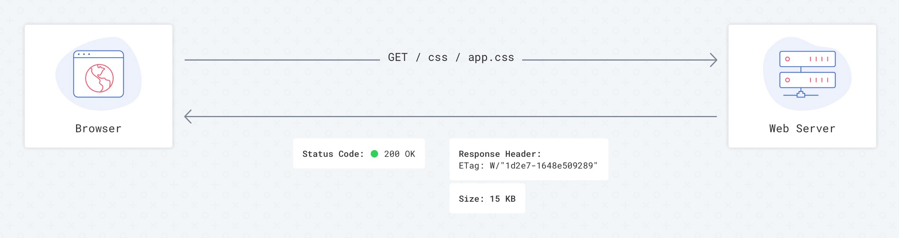

你也许注意到,有时我们访问网站, 也许会出现样式破裂, 或者报错的情况。通常, 导致这些问题的原因是错误的使用 cache control policy。以至于你无法获取最新部署的资源。这篇文章，我
将要演示如何正确的设置缓存来帮助你的网站保持实时更新。

> 如果你只想要最终结果并使用它，你可以直接跳转到[结论](#结论)

## 缓存是如何工作的?

你的浏览器在每一次请求网站/资源时, 尽可能的从本地缓存中读取更多数据。这是唯一的方法让我们提供足够的说明告诉浏览器缓存哪些资源和缓存多久。

这些说明都是声明的; 你想要让浏览器使用你的说明, 你必须增加对应的 HTTP 头信息。 这些通用的请求声明名分别是:

- Cache-Control
- Expires
- Etag
- Last-Modified

大多数的服务器都有一些缓存设置,但是对开发者来说无法很清晰的知道是否真的有缓存机制。

如果没有缓存机制, 浏览器会读取每一个请求的资源。 这大幅度增加加载页面的时间, 同时, 也是增加服务器的压力。

当服务器端没有设置缓存机制的话，这完全由浏览器决定是否缓存信息。当前, Chrome 和 Safari 每一次请求都会下载数据。 不同平台这也许
会有不同的行为。

为了更清晰的应对不同类型文件, 让我们深入了解缓存机制, 一步步添加到请求头中了解对应的结果。

### Etag(Entity Tag)

Etag 是一种缓存设置。使用 Etag 是让浏览器知道相关资源是否有变动而不用下载整个文件。服务器端计算资源/文件的 hash 值,并把它发送给浏览器。当
下次浏览器请求时, 浏览器不会先下载整个文件,而是发送一个（类）prefligt 请求,包含请求头如`If-None-Match: W/“1d2e7–1648e509289`。
服务器端会检测是否根据当前的值找到文件,如果有不一样的，强制浏览器获取新文件。否则, 服务器端会通知浏览器使用缓存的文件。

当启用 Etag 缓存策略时, 我们总是让服务端检测文件是否存在,并且只有检测成功之后, 浏览器根据返回结果决定是否读取缓存或者是重新加载。当一个资源/文件
没有被改动,只会额外产生 80-100 bytes 来验证是否变化，取而代之的是每次获取 10kb 的或者是 10mb 的文件。

### Last Modified

另一种缓存方法时`Last Modified`HTTP 头。 主要原理和 etag 十分相似,但是浏览器的行为有一点点的不一致。服务器端有一个
时间戳记录每一个文件最后修改的时间。当一个文件第一次被下载之后, 浏览器需要查询文件是否被修改，浏览器会发送`If-Modified-Since: Fri, 13 Jul 2018 10:49:23 GMT`
请求头。如果资源/文件已经被修改了,那么浏览器会重新下载新文件，否则使用缓存的版本。

> 但是现实是浏览器都有自己的内部缓存机制, 并且自主决定是否重新下载资源(并不发送验证请求)

> `Last Modified`是一种脆弱的缓存头, 每种浏览器基于自身的请求决定是否使用重新获取数据。
> `Google caching best practices guide`

")

")

所以, 我们不能依赖`Last Modified`，我个人更倾向于完全移除相关功能来减少网络请求，虽然这只需要几 bytes

### Cache-Control max-age

这种缓存允许告诉浏览器需要缓存文件多久。浏览器缓存时间应该保存在文件头中, 这个一个通常的例子`Cache-Control: max-age=31536000`。
使用这种策略，浏览器完全跳过请求服务器并且打开文件特别快。但是, 我们如何保证文件在这么长时间没有变化呢？我们不能！

所以, 强制让浏览器下载新文件版本，我们使用一种资源构建工具(assets builder tools),类似于 Webpack, Gulp。每一个文件
将要被预编译到服务器并且获取其 hash 值。 例如`app-72420c47cc.css`。再小的文件变化也会被映射到 hash 的变化。当每次发布,
你将要获取一个新的文件版本。这可以应用于所有的 css,js,和图片文件(max-age=31536000)。当我们发生变化, 浏览器都会重新获取一个新的资源，然后被缓存。

### Cache-Control no-cache

最奇怪的部分是以上的技术,不能忘记你的 html 文件。如果你使用上面的办法,你从不会获取新的链接

> 备注: html 如果使用完全缓存`max-age=31536000`,那么永远都只会获得缓存中资源文件的地址，而不会获取新地址

我建议你对 html 文件使用 `Cache-Control: no-cache`。使用 `no-cache`并不意味着没有缓存, 它只是简单的告诉
浏览器验证服务器端的资源。 所以同时使用 etag 执行预请求获取文件是否有变动。

## 结论

最终设定

> 1. 使用构建工具例如 Webpack, Gulp 对 css,js,image 文件做 hash 设定,例如`app-67ce7f3483.css`

2. 对 js, css, images 文件，设置 `Cache-Control: public, max-age=31536000`, no Etag, no Last-Modified 设置

3. 对 html 文件, 设置 `Cache-Control: no-cache`以及 Etag

> 备注： If there is a Cache-Control header with the max-age or s-maxage directive in the response, the Expires header is ignored.

## Reference

- [MDN Caching](https://developer.mozilla.org/en-US/docs/Web/HTTP/Caching)
- [MDN Cache-Control](https://developer.mozilla.org/en-US/docs/Web/HTTP/Headers/Cache-Control)
- [MDN Expires](https://developer.mozilla.org/en-US/docs/Web/HTTP/Headers/Expires)
- [MDN Etag](https://developer.mozilla.org/en-US/docs/Web/HTTP/Headers/ETag)
- [MDN Last-Modified](https://developer.mozilla.org/en-US/docs/Web/HTTP/Headers/Last-Modified)
