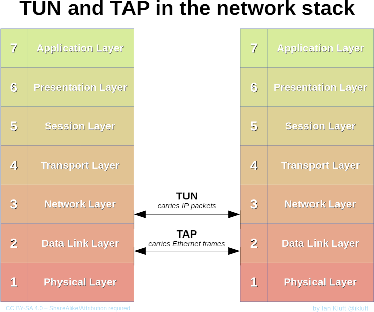

## 背景

有些程序没有遵守代理规范， 使用自定义的方式发起网络请求，这样会导致 clash 即使开了全局代理也无法实现网络代理。
这里就需要传统 vpn 中使用的虚拟网卡实现真正的全局代理

## 设置

- TUN

https://docs.cfw.lbyczf.com/contents/tun.html

- TAP

https://docs.cfw.lbyczf.com/contents/tap.html

> 2 种方式均试过， 个人感觉区别不大

## TUN TAP 的区别

TUN 协议会代理网络 7 层架构中的 Lay3（网络层）， 而 TAP 代理 Lay2(数据联络层), 相对来说 TAP 比 TUN 更一层，能代理的网络请求更多。 传统 vpn 大量使用 TAP 模式实现全局代理

## Reference

- [TUN/TAP](https://en.wikipedia.org/wiki/TUN/TAP)
