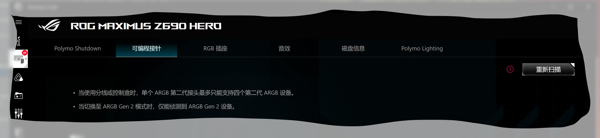

## 背景

最近装机时，内存条无法实现神光同步，经过多方资料查询发现是软件配置问题。

硬件设备

- 主板 华硕 z690 hero
- 铂金统治者 ddr5 5600

## 同步方法

### 安装 asus aura, icue

需要先安装 asus aura, 然后安装 icue. 然后打开 icue 找到内存，最新版本的 icue 已经默认全局控制打开了

> 若 icue 无法显示内存， 需要到 bios 中 (AI Tweaker -> Tweakers Paradise -> SPD Write Disable = False) 开启功能

### 安装 icue aura 插件

需要安装插件使得 icue 和 aura 进行通讯，下载地址 https://downloads.corsair.com/Files/CUE/CorsairPluginForAuraSync_2.0.32.msi

下载安装后， 打开 aura->设备->主板->可编程指针->重新扫描 后就能在 aura sync 下显示内存选项

> 如果无法显示， 需要卸载插件，再次安装重试几次就好

## Reference

- [aura sync crosshair rgb memory](https://hearthstats.net/how-to-enable-aura-sync-control-for-corsair-rgb-memory-2021/)
