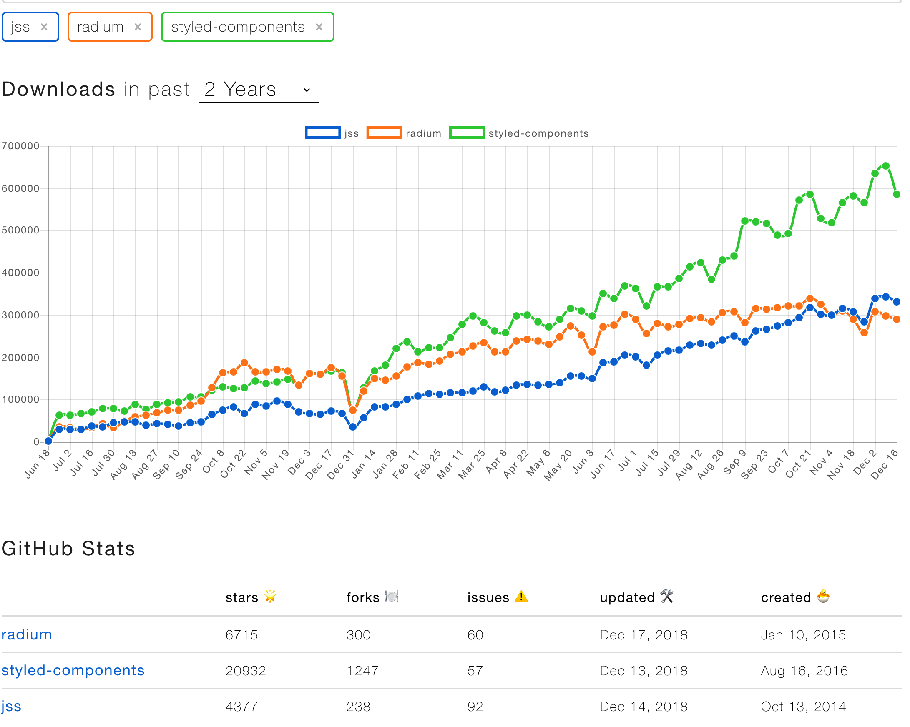

## 背景1

[css-in-js](https://speakerdeck.com/vjeux/react-css-in-js) 在 react 中非常流行, 本文主要介绍如下几种，基本能覆盖当前前端环境下主流 css-in-js 方案

- css-modules
- styled-components
- jss
- radium

## css-in-js 优势

- 所有的样式全部组件化, 符合 react 的设计思维
- 使用 js 代替其他预处理工具, 充分发挥 js 的能力。
- `scoped selectors` 避免全局变量样式冲突
- [code split](https://webpack.js.org/guides/code-splitting/) css 代码分割能够按照 js 逻辑分割，不需要编写额外的 css 分割逻辑
- webpack 能减少一堆 css 相关 loader

## 相关库比较

### css-modules

`css-modules` 其实是一种自动转化 css 代码为 js 的方案, 不是真正的 css-in-js。可以让你使用原有的 css 方案, 例如`less`,`sass`。主要优势为入门简单, 适合已精通预处理工具的开发人员使用，减少学习成本

```css
/* style.css */
.green {
  color: green;
}
```

```jsx{2,6}
import react, { Component } from 'react'
import styles from './style.css'

class Demo extends Component {
  render() {
    return <div style={styles.green}>Demo</div>
  }
}
```

这种方法的主要缺点是他依然还是 css, 编写简单的 css 依然需要额外的文件，并不能完全体现 css-in-js 方案。如果不添加额外的预处理工具, 很难实现复杂页面样式

- code split 对 css 兼容性一般
- 无法发挥 js 的全部威力

> `css-modules` 是以较传统的方式在 react 中写 css, css-in-js 方案并不明显。但胜在技术成熟，稳定，`create-react-app`默认支持这种样式, 适合于 React 新手或者熟悉 sass 等预处理工具的开发者使用

### styled-components

目前为止个人最喜欢的 react css 方案, 还记得刚接触 `styled-components`时, 被他的魔法字符串`tagged template`所震撼, 竟然有这种语法。

```jsx
// Create a Title component that'll render an <h1> tag with some styles
const Title = styled.h1`
  font-size: 1.5em;
  text-align: center;
  color: palevioletred;
`

// Create a Wrapper component that'll render a <section> tag with some styles
const Wrapper = styled.section`
  padding: 4em;
  background: papayawhip;
`

// Use Title and Wrapper like any other React component – except they're styled!
render(
  <Wrapper>
    <Title>Hello World!</Title>
  </Wrapper>
)
```

深入使用了一段时间之后, 对他爱不释手。 我大致总结了以下几个有点

- 极其简单自然的写法 : 初次接触 styled-components 的人, 一定会有 2 种感觉, 简单和神奇

  - 神奇: `tagged template` 语法很奇怪,竟然可以这样用。
  - 简单: 所有东西均为组件, 用起来易上手, 没有一堆配置, 安装包即可使用

- 自动处理 css `vendor-prefix`, `scoped selectors`
- 和 react 生态圈完美兼容: 主题使用 `Provider`, 全局样式: `injectGlobal`, 样式覆盖 styled(Comp)。这一切对于熟悉 react 的人来说很容易过度
- 主题切换: 在开发项目的时候, 主题切换在传统 css 方案时，只能服务端切换, 但是 styled-components 让前端变化变的可能。仅仅需要修改组件的样式即可。

  ```jsx
  import styled, { ThemeProvider } from 'styled-components'

  const Box = styled.div`
    color: ${props => props.theme.color};
  `

  render(
    <ThemeProvider theme={{ color: 'mediumseagreen' }}>
      <Box>I'm mediumseagreen!</Box>
    </ThemeProvider>
  )
  ```

- 强大的`tagged template` : 也许是`es6`最吸引我的功能了, 他让拼接字符串变的这样强大，富有乐趣。
  - 例如: `sass`提供很多颜色相关的工具方法, 但在使用过程中由于不是专业的设计人员, 程序员更喜欢量化的东西, sass 中的方法会使得我一脸困惑 😪
  - 更优雅的, 更精准的 响应式(media query)
  - 通过简单的类`less`占位符例如 `&`, 实现复杂的 nest 变的可能
  - 真正的 js 方案写 css, 解锁 🔓 所有 js 的威力

当然, 任何库都有缺点, styled-components 也不例外。 所有的 css 写在了 js 文件中, 会显得代码凌乱。如果细究其实现原理的话, 会发现并不是真正把样式内联在组件上，而是通过 style 的形式。严格上来说是 css-in-js 的变异实现。
这篇[文章](https://medium.com/styled-components/how-styled-components-works-618a69970421)讲解了实现原理

### jss

`jss`的语法更像 js,如果对不想混合 js 和 css 在一个文件之中的开发者, jss 会更加适合。因为他使用类似于 json 的语法描述 css, 对不善于使用 css 技巧的开发者而言，是更理想的 css 库。

```jsx{8-29}
import jss from 'jss'
import preset from 'jss-preset-default'
import color from 'color'

// One time setup with default plugins and settings.
jss.setup(preset())

const styles = {
  button: {
    fontSize: 12,
    '&:hover': {
      background: 'blue',
    },
  },
  ctaButton: {
    extend: 'button',
    '&:hover': {
      background: color('blue')
        .darken(0.3)
        .hex(),
    },
  },
  '@media (min-width: 1024px)': {
    button: {
      width: 200,
    },
  },
}

const { classes } = jss.createStyleSheet(styles).attach()

document.body.innerHTML = `
  <button class="${classes.button}">Button</button>
  <button class="${classes.ctaButton}">CTA Button</button>
`
```

在开发表现行为和 styled-components 几乎一致, 同样具有 styled-components 的优点和缺点。

> `jss` 与 `styled-components` 最大的区别在于 `styled-components` 注重于使用`tagged template`实现原生的 css 语法, 而 `jss` 更看重真正的 css-in-jss 的 json 语法。 个人更倾向于前者, 能够少学一个 css 风格的 json 语法, 写 css 我还是更喜欢直接 css 的语法。

另外由于 `jss`是后起之秀, 在 github 欢迎程度和资料成熟度上比 `styled-components` 有差距, 故`jss`的学习难度更高一点。

### radium

最早的 css-in-js 方案之一, 也是我最先接触的 css-in-js 方案。他是真正的把 css 变为内联的形式,然后动态转换为 React inline style, 在技术上来说, 他是可行的。可是, 现实总是不是完美的。

- 伪类: `before`, `after`, `hover` 等使用了 js 方式或者不支持, 表现行为和 css 不一致
- nest 实现复杂
- 写法繁琐, 代码逻辑复杂, 学习曲线高
- 第三方兼容差

曾经使用`radium`写个项目，中途放弃了。想要在 radium 中实现复杂 css, 太痛苦, 还不如直接写 css。

> `radium` 是 css-in-js 方案的先行者, 但是开发体验不行: 学习成本高、代码复杂、重写第三方组件复杂等问题。另外当下似乎也有些过时了。故不推荐学习使用。使用 `radium` 还不如`jss`

## 结论

每一种方案都有背后的用户，需要善于分析实际情况，挑选更适合自己的。如果你

- `css-modules` : 非常熟悉 sass,less 等预处理工具的，使用

- `radium` : 真正 css-in-js 粉丝,愿意花大量时间雕琢样式

- `jss`: 喜欢`json`风格 css 或者体验新库

- `styled-components`: 不善于 sass,less, 但希望有 sass,less 等高级工具方法的用户

- 不想如此复杂, 其实 css 足够了

最后放个 npm 趋势图：


