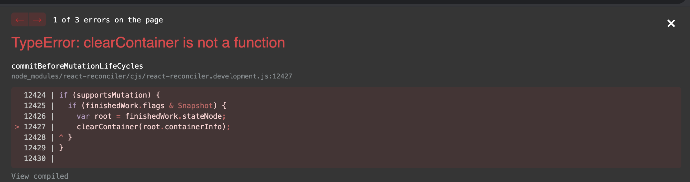
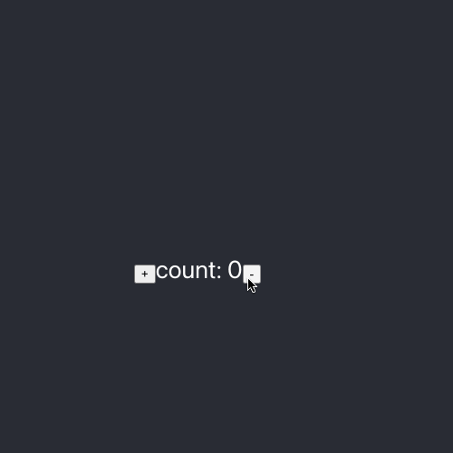

## 背景

以前，写过一个自定义 react render 的[仓库](https://github.com/JennerChen/my-hello-react-custom-renderer) ，核心通过 react-reconciler 实现 ract
中生命周期来实现自定渲染。现 react hooks 已经大面积使用，是否可以继续使用上述方法实现自定义渲染？ 如下是个人尝试

## 初始工程

> react-reconciler 各版本之前不兼容， 当前例子为 0.26.2。 也是因为这个原因， 直接升级 react 版本可能会导致错误

```shell
npx create-react-app my-custom-react-hooks

cd my-custom-react-hooks & npm run start
```

将[旧 render 文件](https://github.com/JennerChen/my-hello-react-custom-renderer/blob/master/src/myCustomRenderer.js) 复制到新工程下, 创建文件 `myRender.js`

新建文件 `HookComp.js`

```javascript
import React, { useState } from 'react'

export default function() {
  const [count, setCount] = useState(0)

  return (
    <div>
      <button onClick={() => setCount(count + 1)}>+</button>
      count: {count}
      <button onClick={() => setCount(count - 1)}>-</button>
    </div>
  )
}
```

调整文件 `App.js`

```javascript
import logo from './logo.svg'
import './App.css'
import HookComp from './HookComp'

function App() {
  return (
    <div className="App">
      <header className="App-header">
        <HookComp />
      </header>
    </div>
  )
}

export default App
```

## 问题排查

### 启动报错



修复方法: 缺失 clearContainer 方法， 补充即可

https://github.com/JennerChen/my-custom-react-hooks/blob/1.0.0/src/myRender.js#L91-L92

### 无法更新状态



修复方法:

1. hooks 的 onclick 事件每次都是更新节点都要替换之前的， 此处需要特殊兼容处理。

https://github.com/JennerChen/my-custom-react-hooks/blob/1.0.0/src/myRender.js#L66-L72

> 这涉及到 js 闭包问题，整体比较复杂。 记住, 实际 dom 节点原本是绑定的是第一次的 onclick 闭包，之后更新的不会主动替换。 本地变量 count 自然永远都是第一次 0

2. text 文本节点无法更新

https://github.com/JennerChen/my-custom-react-hooks/blob/1.0.0/src/myRender.js#L81-L84

原本 `textInstance.text = newText;` 本人尝试无法更新节点，不知道 react-dom 内部如何实现该功能的， 此处替换 `textInstance.replaceData(0, textInstance.length, newText);` 即可解决问题

> 待有空深入了解

## 结论

`react-reconciler` 可以帮助开发者高度定制 render 方法，用于一些非传统 web 环境，例如 terminal, hardware iot. 但在使用过程中，也会遇到很多问题，基于
时间不够充分，只能见招拆招，不能深入理解。 下个月会出一个自定义 react hooks 的能力， 实现一个简易版本 react

> 本次所有代码仓库: https://github.com/JennerChen/my-custom-react-hooks

## Reference

- [react-reconciler](https://github.com/facebook/react/tree/main/packages/react-reconciler)
