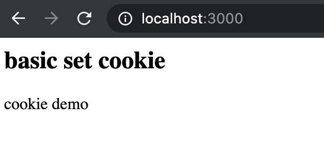
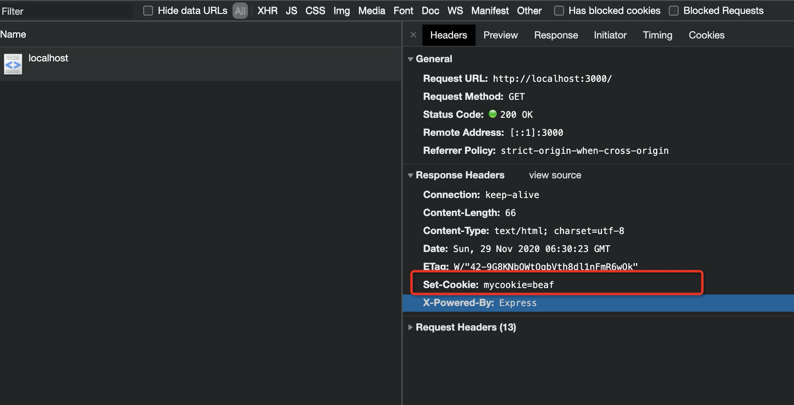
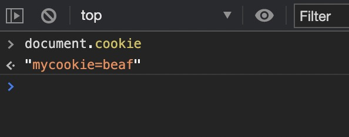
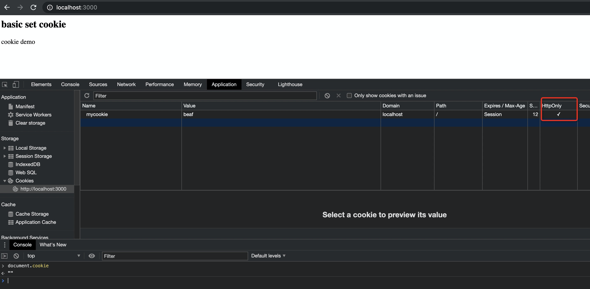
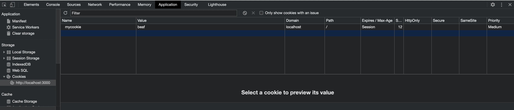
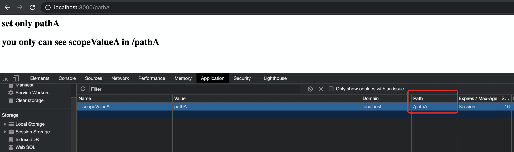
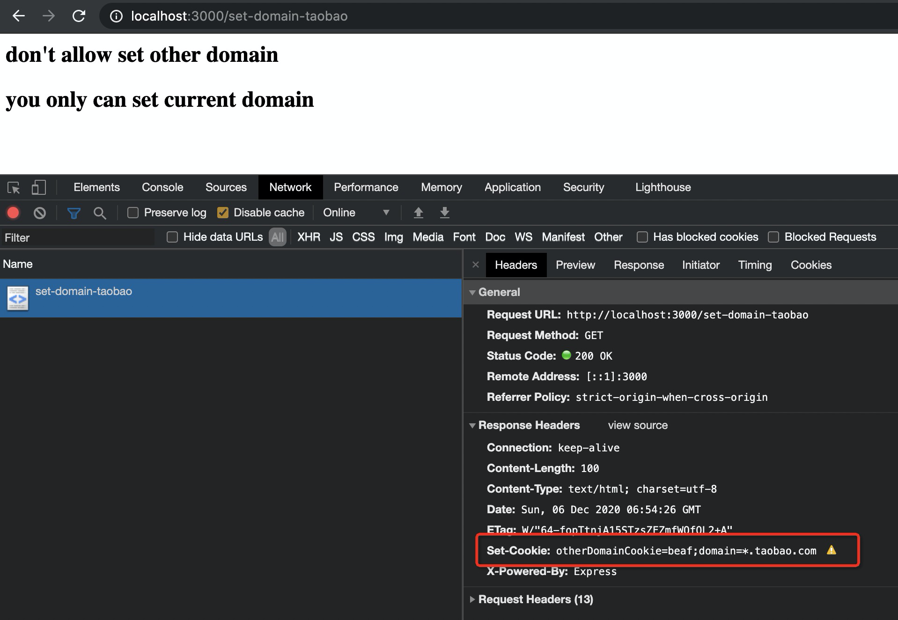
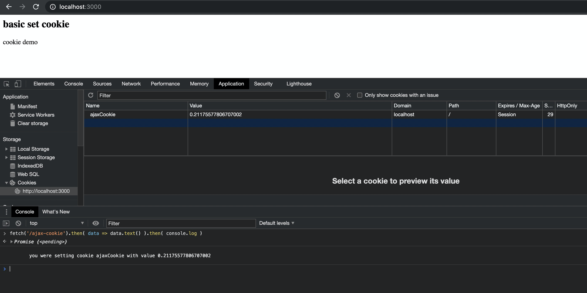

## 什么是 cookie?

cookie 是后端可以存储在用户浏览器中的微小数据块。用户跟踪、个性化以及最重要的身份验证是 cookies 最常见的用例。

Cookie 有很多隐私问题，多年来一直受到严格的监管

在这篇文章中，我将主要关注技术方面：您将学习如何在前端和后端创建、使用和使用 http cookie。

## 配置后端服务

使用 express 搭建简易后端服务

```shell script
git clone -b basic-server https://github.com/JennerChen/cookie-guide.git

cd basic-server && yarn

yarn run server
```

你将会启动一个 web 服务，通过访问 localhost:3000 会看到页面内容如下



## 谁能设置 cookie

服务端和客户端都可以设置 cookie, 客户端在设置 cookie 时有一些限制。通常来说，在服务端设置的 cookie 用于用户私密状态保存

### 服务端设置

通过响应头`Set-Cookie`设置 cookie, 如下代码第 8 行`res.set('Set-Cookie', 'mycookie=beaf')`会以 key/value 形式设置
mycookie=beaf

```javascript{10}
const express = require('express')
const app = express()
const port = 3000

app.get('/', (req, res) => {
  const content = `
        <h2>basic set cookie</h2>
        <p>cookie demo</p>
    `
  res.set('Set-Cookie', 'mycookie=beaf')
  res.send(content)
})

app.listen(port, () => {
  console.log(`Example app listening at http://localhost:${port}`)
})
```



> 查看本片段代码 https://github.com/JennerChen/cookie-guide/tree/server-set-cookie

查看 cookie:

- 通过 document.cookie 查看



> 若不想客户端通过 document.cookie 获取该字段， 可以额外添加`HttpOnly`(res.set('Set-Cookie', 'mycookie=beaf;HttpOnly'))



- 通过 chrome devtool 查看



- 命令行

```shell script
curl -I http://127.0.0.1:3000 --cookie-jar mycookie
```

### path 和 domain

`path`用于设置 cookie 在同一个域名下的可见范围，`domain`用于不同域名之间 cookie 的隔离。

如下例子， cookie `scopeValueA`只能在 `/pathA` 路径下获取， `scopeValueB`只能在 `/pathB` 路径下获取

```javascript{6,15}
app.get('/pathA', (req, res) => {
  const content = `
        <h2>set only pathA</h2>
        <h2>you only can see scopeValue in /pathA</h2>
    `
  res.set('Set-Cookie', 'scopeValueA=pathA;path=/pathA')
  res.send(content)
})

app.get('/pathB', (req, res) => {
  const content = `
        <h2>set only pathA</h2>
        <h2>you only can see scopeValue in /pathB</h2>
    `
  res.set('Set-Cookie', 'scopeValueB=pathB;path=/pathB')
  res.send(content)
})
```



和 path 类似，但 domain 只允许设置当前 host, 不允许设置其他域名

```javascript{6}
app.get('/set-domain-taobao', (req, res) => {
  const content = `
        <h2>don't allow set other domain</h2>
        <h2>you only can set current domain</h2>
    `
  res.set('Set-Cookie', 'otherDomainCookie=beaf;domain=*.taobao.com')
  res.send(content)
})
```

在 chrome 下， 会得到一个警告， 所以浏览器会拒绝设置。


> 域名支持 wildcard 配置，简单来说 example.com 能够配置 所有 \*.example.com 下的 cookie。 详见[域名匹配规则](https://serverfault.com/questions/153409/can-subdomain-example-com-set-a-cookie-that-can-be-read-by-example-com)

异步 ajax 请求

ajax 可以携带/设置 cookie

```javascript
app.get('/ajax-cookie', (req, res) => {
  let cookieValue = Math.random()
  const content = `
       you were setting cookie ajaxCookie with value ${cookieValue}
    `
  res.set('Set-Cookie', `ajaxCookie=${cookieValue}`)
  res.send(content)
})
```

在浏览器中， 执行如下代码

```javascript
fetch('/ajax-cookie')
  .then(data => data.text())
  .then(console.log)
```



> 若请求为跨域请求(localhost:3000 请求 localhost:3001), 服务端必须配置[cors](https://developer.mozilla.org/en-US/docs/Web/HTTP/CORS)且客户端需要声明 credentials: "include"才能携带 cookie

https 访问: Secure

## cookie 关键属性作用

### name

名称， cookie 以 key/value 存储， key 即 name

### value

cookie 名称对应的值, 可以以任意字符串保存(json 务必以 JSON.stringify 方式保存)

### expire/Max-Age

cookie 有效期, 默认为 Session, 即关闭浏览器即过期。

> Max-Age 优先级高于 expire

> Max-Age 指客户端创建 cookie, 有效的时间段。 expire 是具体日期如 2020-12-31, 即 2020-12-31 过期

### path

path 指 cookie 的范围. 例如 `res.set('Set-Cookie', 'scopeValueA=pathA;path=/pathA')`，那么 scopeValue 仅可在 pathA 下获取。详见[例子](https://github.com/JennerChen/cookie-guide/blob/server-set-cookie-path/server/index.js#L22-L38)

> 当不传 path, path 默认值为`/`, 即全部可见

### domain

domain 是 cookie 的分割范围，仅能设置当前域名。配置方式和 path 类似

### httpOnly

是否允许客户端读取字段，默认 false。 若配置为 true, 那么 document.cookie 无法获取。

### Secure

是否仅允许 https 协议访问， 若配置成 true, cookie 必须在 https 协议下生效

> 该值仅可在服务端设置

### sameSite

共有 3 种有效值，先期默认值为`None`, 先阶段默认值为`Lax`。

- Lax:
  所有的 cookie 只能在`first-party`端中使用，在`third-party`会被拦截。 但`third-party`链接会携带 cookie
- Strict
  所有的 cookie 只能在`first-party`端中使用，在`third-party`会被拦截, 包括`third-party`链接
- None
  cookie 都能在`first-party`,`third-party`中使用，但必须开启 secure 标签

> `first-party` 为 _.example.com 的域名。 所有不满足 _.example.com 的域名称为 `third-party`

> 若期望 cookie 被 `third-party` 携带， 必须启用 secure, 例如 Set-Cookie: flavor=choco; SameSite=None; Secure 。 换句话说，必须使用 https 才能搭配 samesite=none 使用

### Priority

优先级, 当 cookie 超出容积时，基于如下顺序删除 cookie low->medium->high.默认为 medium, 故常用做法是将 用户 token 存于 high, 用户行为信息存于 low

- high:
- medium
- low

## Reference

- [fetch](https://developer.mozilla.org/en-US/docs/Web/API/Fetch_API/Using_Fetch)
- [CORS](https://developer.mozilla.org/en-US/docs/Web/HTTP/CORS)
- [can-subdomain-example-com-set-a-cookie-that-can-be-read-by-example-com](https://serverfault.com/questions/153409/can-subdomain-example-com-set-a-cookie-that-can-be-read-by-example-com)
- [Implementing Priority Field for Cookies](https://bugs.chromium.org/p/chromium/issues/detail?id=232693)
