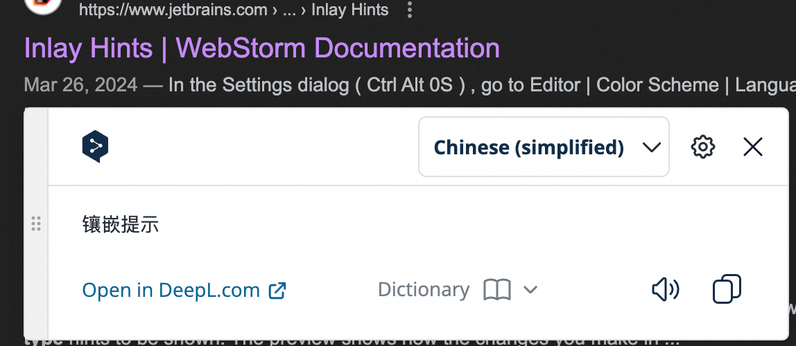
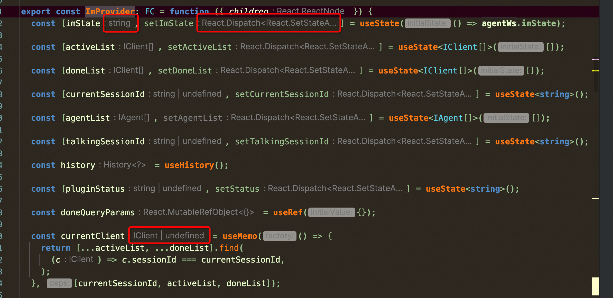
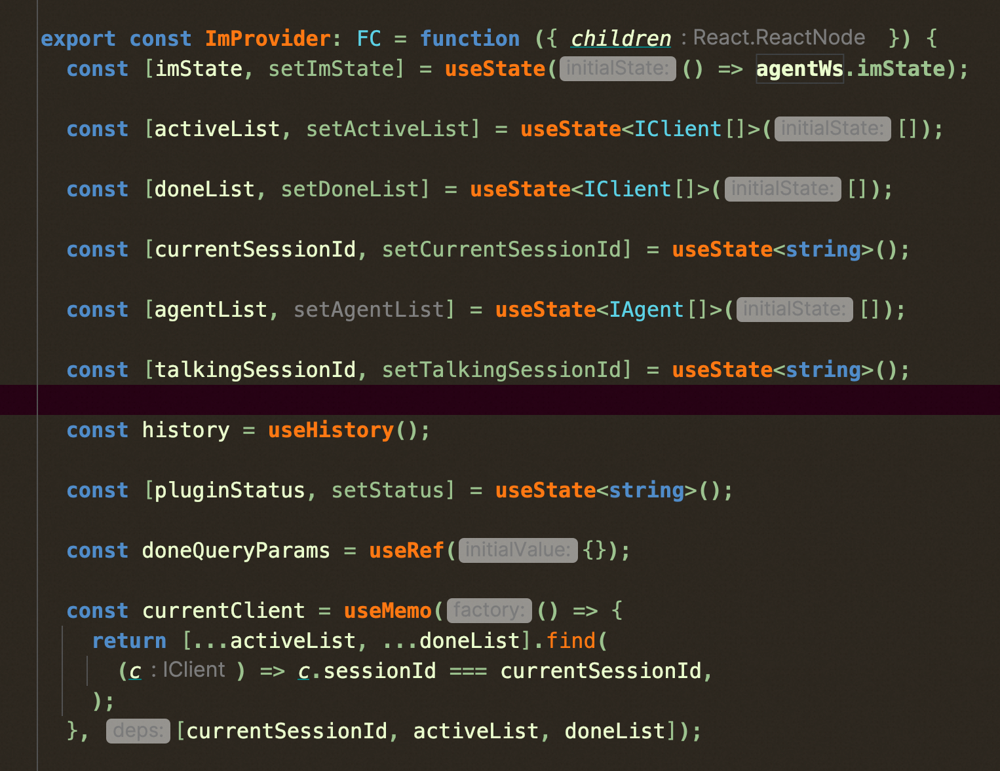
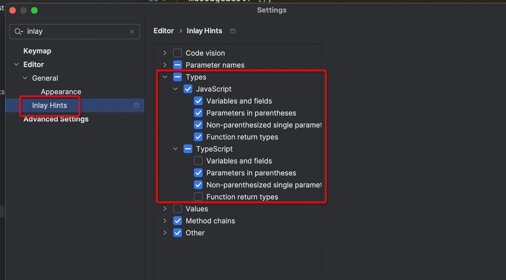

## 背景

idea 版本之间个人配置在跨版本升级时， 经常容易丢失。此处记录下 如何配置, 以防丢失

## inlay hints
中文意思镶嵌提示

开启后变量后面有相关的类型显示，但是会导致在开发过程中闪动和文案超长，大幅降低阅读性

通过 settings -> Inlay hints -> 关闭 types 解决

## Reference

https://www.jetbrains.com/help/webstorm/inlay-hints.html#enable_inlay_hints

