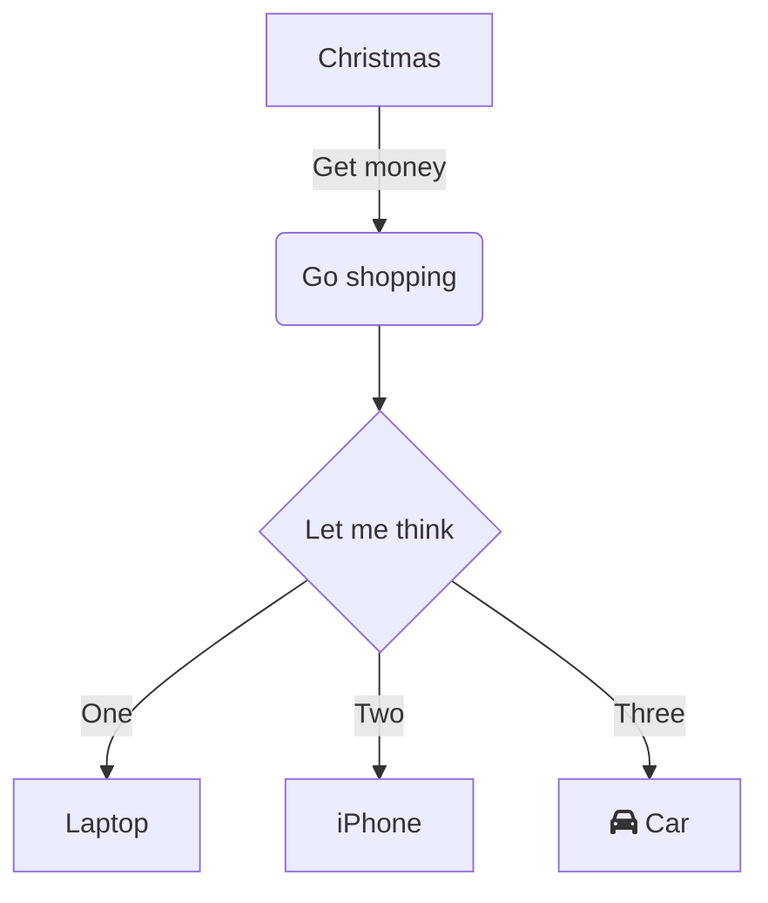
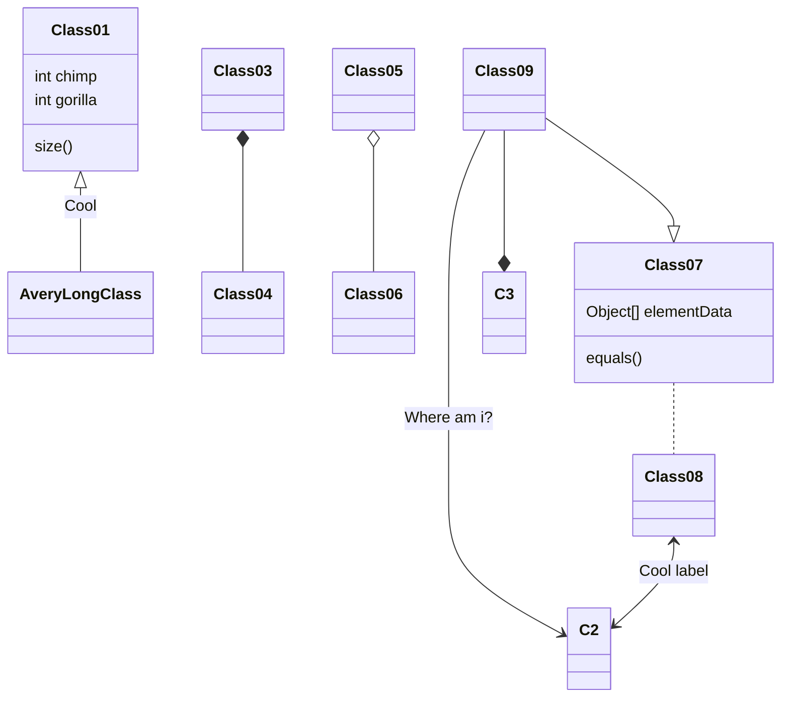
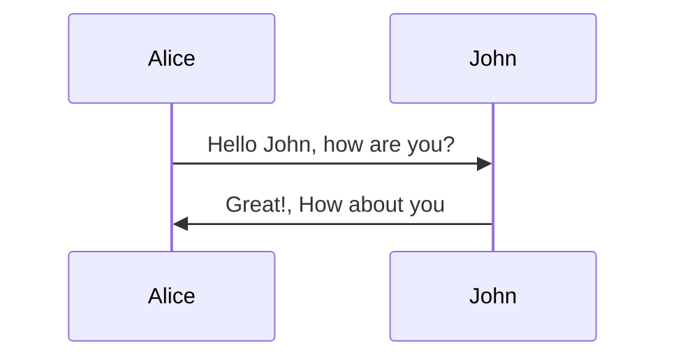
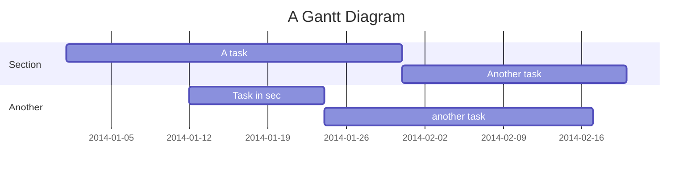
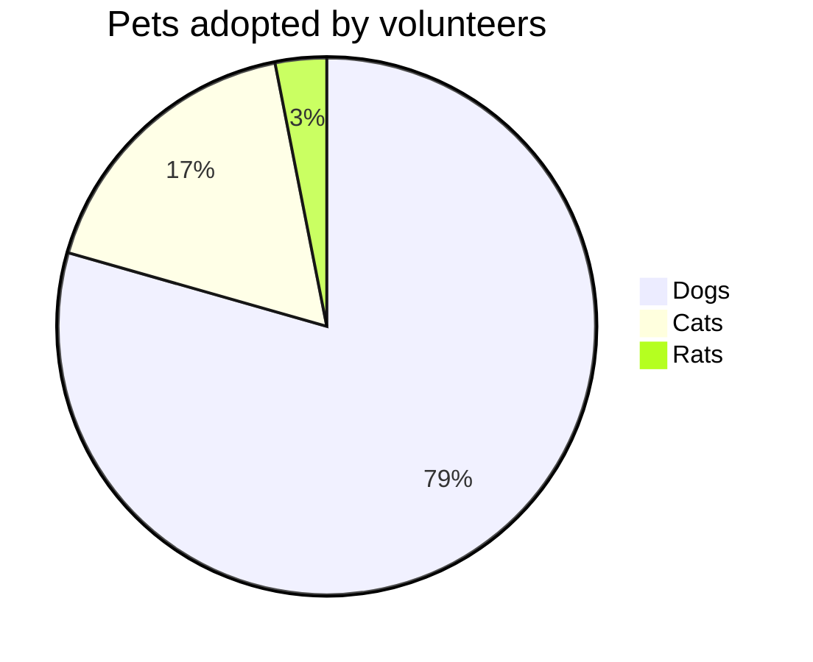

程序架构设计或多或少需要流程图，流程图的绘制因人而异。 使用 markdown 能用接近于编程的视角绘制流程图，更能体验逻辑正确.
本文主要基于 [mermaid](https://mermaid-js.github.io/mermaid/#/) 绘制流程图

## 安装

mermaid 提供多种安装方式, 一般与 markdown 解析器能都完美集成。 当前博客基于 gatsby 实现，通过插件即可直接接入`gatsby-remark-mermaid`

## 画法

详细的教程在官网有说明，这里只介绍一些通用的规则

- 第一行用去声明图类型 `graph TD` 则为线框图, 如果后续有参数如 `TD` 表明是改图标的参数

### graph

```text
graph TD
    A[Christmas] -->|Get money| B(Go shopping)
    B --> C{Let me think}
    C -->|One| D[Laptop]
    C -->|Two| E[iPhone]
    C -->|Three| F[fa:fa-car Car]
```



### class

```text
classDiagram
Class01 <|-- AveryLongClass : Cool
Class03 *-- Class04
Class05 o-- Class06
Class07 .. Class08
Class09 --> C2 : Where am i?
Class09 --* C3
Class09 --|> Class07
Class07 : equals()
Class07 : Object[] elementData
Class01 : size()
Class01 : int chimp
Class01 : int gorilla
Class08 <--> C2: Cool label
```



### sequence

```text
sequenceDiagram
    participant A as Alice
    participant J as John
    A->>J: Hello John, how are you?
    J->>A: Great!, How about you
```



### gantt

```text
gantt
    title A Gantt Diagram
    dateFormat  YYYY-MM-DD
    section Section
    A task           :a1, 2014-01-01, 30d
    Another task     :after a1  , 20d
    section Another
    Task in sec      :2014-01-12  , 12d
    another task      : 24d
```



### pie

```text
pie title Pets adopted by volunteers
    "Dogs" : 386
    "Cats" : 85
    "Rats" : 15
```



## Reference

- [mermaid](https://mermaid-js.github.io/mermaid/#/)
- [在线编辑器](https://mermaid-js.github.io/mermaid-live-editor/#/edit/eyJjb2RlIjoiZ3JhcGggVERcbiAgICBBW0NocmlzdG1hc10gLS0-fEdldCBtb25leXwgQihHbyBzaG9wcGluZylcbiAgICBCIC0tPiBDe0xldCBtZSB0aGlua31cbiAgICBDIC0tPnxPbmV8IERbTGFwdG9wXVxuICAgIEMgLS0-fFR3b3wgRVtpUGhvbmVdXG4gICAgQyAtLT58VGhyZWV8IEZbZmE6ZmEtY2FyIENhcl1cbiAgICAgICAgICAgICIsIm1lcm1haWQiOnsidGhlbWUiOiJkZWZhdWx0In0sInVwZGF0ZUVkaXRvciI6ZmFsc2V9)
