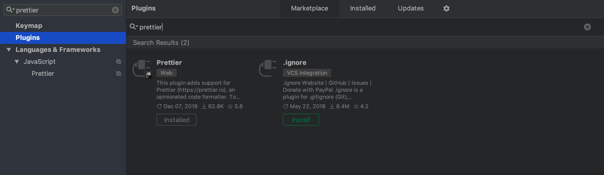
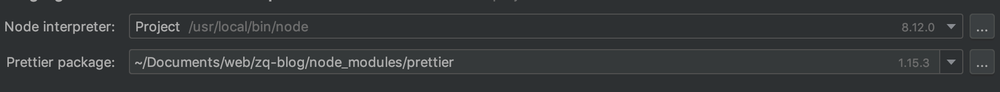
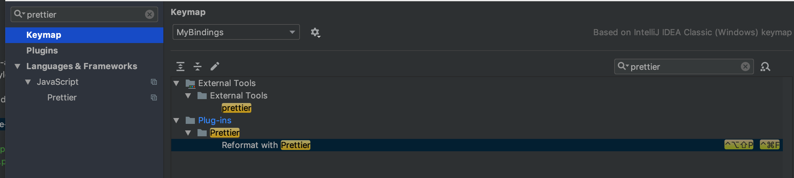

`prettier`是一个固定的代码格式化程序。如果您再也不想担心代码格式化，请在编辑器中安装 Prettier，它将为您处理格式化。 Prettier 从您的代码中创建一个抽象语法树，并使用它来编写根据一组规则格式化的新代码。

这是我安装 `prettier`, `husky`, `lint-staged`的过程, 目标自动格式化代码,统一团队开发规范

> 安装版本为: `prettier`(v1.15.3), `husky`(v1.3.1), `lint-staged`(v8.1.0)，`webstorm`(2018.3.2)不同版本也许会不一致

## 安装 prettier

```bash
yarn add prettier --dev
```

### webstorm 配置

`perferences` -> `plugins` -> 搜索 `prettier`, 安装插件。



重启 webstorm

`perferences` -> `Languages & Frameworks` -> `Javascript` -> `prettier`, 设置 prettier 安装目录



最后设置快捷键 `perferences` -> `keymap` -> 搜索`prettier`, 然后设置快捷键, 我设置成了 `command + shift + f`



## 安装 husk, lint-staged

```bash
yarn add husky lint-staged --dev
```

然后在`package.json`中添加

```json
{
  "husky": {
    "hooks": {
      "pre-commit": "lint-staged"
    }
  },
  "lint-staged": {
    "**/*.{js,json,md}": ["prettier --write", "git add"]
  }
}
```

随意修改文件,然后 git commit, 文件自动被格式化了 👌

## FAQ

### prettier , husk, lint-stage 关系

prettier 只会格式化代码, 但是他不会决定你何时格式化代码。

husky 是 git 钩子，让你在各个周期中执行自定义脚本

lint-staged 相当于 git 的 eslint,其实如果不用 lint-staged,也是可以的

### prettier vs eslint

eslint 功能其实比 prettier 功能更多, prettier 不会阻塞开发者, 也不会执行语法检查。在开发中, 个人认为 eslint 适合多人协作项目, 小团队并不适用。

## Reference

[husky](https://github.com/typicode/husky)

[lint-staged](https://github.com/okonet/lint-staged)

[prettier](https://prettier.io)
