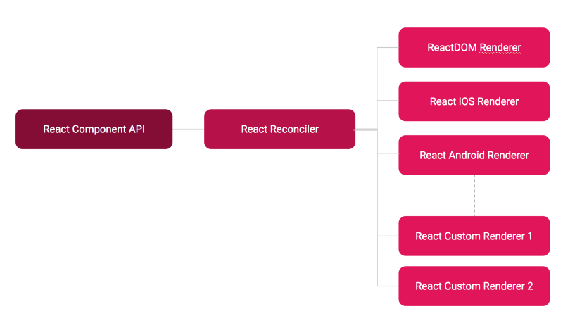

---

title: React 也是一种 LLVM UI 框架(翻译)
commentIdentifier: React 也是一种 LLVM UI 框架
date: '2019-03-18'
tags: ['react']
original: 'https://medium.com/@agent_hunt/react-is-also-the-llvm-for-creating-declarative-ui-frameworks-767e75ce1d6a'

---

[LLVM](https://llvm.org/)是一组模块化和重用编译和工具链技术, LLVM 使得开发中能够简单的创造编程语言。

当我们首次见到React, 它介绍他是`A JavaScript library for building user interfaces`。当你深入了解其内部,React同样也可以被称为LLVM用来构建UI。它让开发中能够简单的构建声明式UI。

如果你问为什么你要使用声明式UI, 因为他更容易阅读,编写, 管理和测试，以及深度测试(100%单元测试), 手动管理更新UI是笨重和容易出错的, 但是类似于React的工具能够做的更好。

React一开始用于web开发, 但最近它的概念能够适用于更多的地方, 例如React Native构建IOS和安卓设备。我们也可以使用相同的组件风格构建不同平台的UI。

React有3种基本模块

1. React Component API: 提供组件API和生命周期

2. React-Reconciler: 它是React核心diff算法管理如何更新UI. Reconciler是真正方法的计算出当前UI的变化, 你可以阅读更多的 reconcilication的内容 https://reactjs.org/docs/reconciliation.html

3. React Renderer: 一个 renderer除了实现一些定义在React-Reconciler的方法,不做任何事情。 React-Reconciler 会执行这些定义的方法然后更新UI。如果你实现这些方法使用DOM API， 那么目标就是web。如果你实现这些使用IOS UI Kit API, 那么目标就是IOS。如果你实现这些方法使用Andorid UI API, 目标就是Android。实际上, 如何支持UI的系统都可以使用React。它不需要使用React去绘制。这种抽象很疯狂。 你可以查看这个有趣的视频 [ Ken Wheeler https://www.youtube.com/watch?v=PBpugV5l90c](https://www.youtube.com/watch?v=PBpugV5l90c) 他使用了一个自定义的renderer实现音乐组合。另外一个有趣的是 [ Dusten Kasten 的React Hardware](https://github.com/iamdustan/react-hardware)

[React-reconciler](https://github.com/facebook/react/tree/master/packages/react-reconciler) 在React v16时被完全重写为了更好的实现新的算法架构React Fiber。在那之前, React算法和dom紧紧相关。现在, 他可以更简单的编写自定义renderers。 [React-reconciler](https://github.com/facebook/react/tree/master/packages/react-reconciler) API并不按照公共API那样, 他经常变动, 因为他总是需要进行优化。

你可以查看更多自定义renderers在下面这个链接中

[https://github.com/chentsulin/awesome-react-renderer](https://github.com/chentsulin/awesome-react-renderer)
