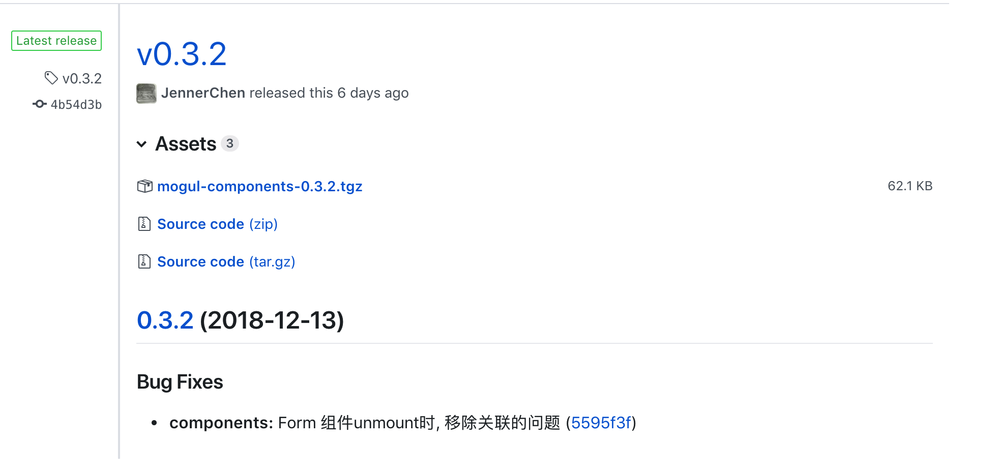

## 背景

最近由于公司需求, 需要向 npm 推送不少包, 但是包的版本管理很麻烦。于是就寻找有没有什么高级一点的办法，首选是自己写[脚本](https://github.com/freshesx/mogul/blob/master/scripts/publish.js), 然后发现了 semantic-release

> semantic-release automates the whole package release workflow including: determining the next version number, generating the release notes and publishing the package. 自动化发布 package 包括: 决定迭代版本, 生产 release 日志, 以及推送 package 到服务器

初看正好符合我的需求, 故就尝试将它集成到我的[mogul](https://github.com/freshesx/mogul)中

## 安装

项目根目录:

```bash
yarn add semantic-release --dev
```

然后在目录下创建文件`.releaserc`, 配置方式和 `.babelrc`类似, 就是一个 json 文件

```json
{
  "branch": "master",
  "dryRun": false,
  "debug": false,
  "plugins": [
    "@semantic-release/commit-analyzer",
    "@semantic-release/release-notes-generator",
    [
      "@semantic-release/npm",
      {
        "tarballDir": "dist"
      }
    ],
    [
      "@semantic-release/git",
      {
        "assets": ["package.json"],
        "message": "chore(🤖):${nextRelease.version} [skip ci]\n\n${nextRelease.notes}"
      }
    ],
    [
      "@semantic-release/github",
      {
        "assets": "dist/*.tgz"
      }
    ]
  ],
  "preset": "angular"
}
```

| 字段    | 描述                                                          |
| ------- | ------------------------------------------------------------- |
| branch  | 发布 git 分支名字, 我的需求是只对 `master` 起作用             |
| dryRun  | 是否空跑, 用于测试, false                                     |
| debug   | 是否打印更多信息, 便于调试, 用于测试, false                   |
| preset  | 默认就是`angular`, react 没有对应的 preset, 所以选了`angular` |
| plugins | 一系列的配置, 注意, 这些和 babel 不同, 不需要安装这些依赖     |

至此，安装完成！ Easy!

## circleci 构建

21 世纪的项目不走 CI 构建就显得 out 了, 新增 `.circleci/config.yml`。更多配置请见 [circleci](https://circleci.com/docs/)

```yaml{31,37-43}
version: 2
jobs:
  test:
    docker:
      - image: circleci/node

    working_directory: ~/repo

    steps:
      - checkout
      - restore_cache:
          keys:
            - v1-dependencies-{{ checksum "package.json" }}
            - v1-dependencies-

      - run: yarn install

      - save_cache:
          paths:
            - node_modules
          key: v1-dependencies-{{ checksum "package.json" }}

      - run: yarn run test
  release:
    docker:
      - image: circleci/node
    steps:
      - checkout
      - run: yarn install
      - run: yarn run build
      - run: npx semantic-release # 使用 npx semantic-release 替代npm publish

workflows:
  version: 2
  test_and_release:
    jobs:
      - test
      - release:
          requires:
            - test # 只有测试完成, 才能执行release
          filters:
            branches:
              only: master # 设置 release只对master生效
```

同样的, 需要在 circleci 中设置全局环境变量:

- github 读写权限: [`GH_TOKEN`](https://help.github.com/articles/creating-a-personal-access-token-for-the-command-line/)
- npm 读写权限: [`NPM_TOKEN`](https://docs.npmjs.com/about-authentication-tokens)

我的包都是基于 npm 的, 故其他的仓库需要对应仓库的`token`

CI 配置结束。

> 如果不用 ci, 那么在项目根目录下执行 npx semantic-release 即可。当然 GH_TOKEN, NPM_TOKEN 也都是要的

## 其他

1 : 花了这么多时间加的高大上插件, 一定要让别人知道, 在 readme.md 下加入如下内容

```markdown
[](https://github.com/semantic-release/semantic-release)
```

效果如下: [](https://github.com/semantic-release/semantic-release)

2 : 默认 semantic-release 不会重新 commit 新版本的代码, 所以你 npm install 的包版本永远不会更新, 如何解决
使用插件 `@semantic-release/git`, 在 `.releaserc`加入

```json
[
  "@semantic-release/git",
  {
    "assets": ["package.json"],
    "message": "chore(🤖):${nextRelease.version} [skip ci]\n\n${nextRelease.notes}"
  }
]
```

3 : preset: `angular`是什么?
[angular Commit Message Conventions](https://gist.github.com/stephenparish/9941e89d80e2bc58a153)就是一套 git 生成 release 日志的约定, 如果是开源项目, 使用效果不错，能减少很多工作量, 但是似乎不适合生成业务逻辑的 changelog

效果如下: 是不是效果还凑活


## 结论

相比于用脚本的方式自动发布, semantic-release 更简单、高大上。但也有缺点, 对于内部项目, 不适合, 缺少相关插件，还不如自己写脚本效率和实用
