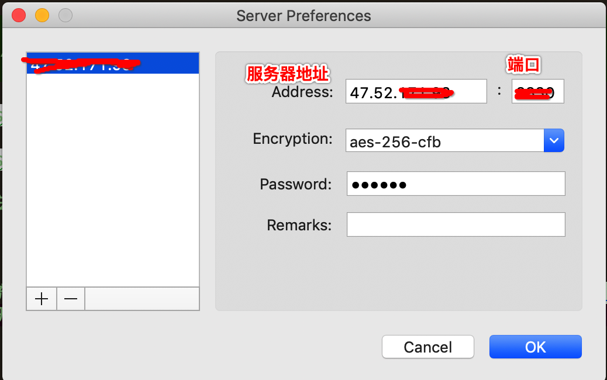

## 背景

程序员学会翻墙是必备的技能之一, 但是这2年以来,vpn基本被封杀完了，所以只能自己动手使用shadowsocks搭建服务。

## 安装条件

- 1台可以访问google的linux服务器

## 安装

### 服务器端
```bash
yum install python-setuptools && easy_install pip
pip install git+https://github.com/shadowsocks/shadowsocks.git@master
```
我们使用配置文件启动

```bash
cd / && mkdir sss
vi config.json
```
然后写入如下内容
```json
{
    "server":"0.0.0.0",
    "server_port":8388,
    "local_address": "127.0.0.1",
    "local_port":1080,
    "password":"mypassword",
    "timeout":300,
    "method":"aes-256-cfb",
    "fast_open": false
}
```

然后启动服务
```bash
ssserver -c /sss/config.json -d
```

> 启动服务 `ssserver -c /sss/config.json -d start`

> 停止服务 `ssserver -c /sss/config.json -d stop`

然后你的服务就安装完成了

### 客户端

安装对应操作系统下的[客户端](https://github.com/shadowsocks/shadowsocks/wiki/Ports-and-Clients),以mac为例
安装完成后, 打开服务器, 然后按照上方config.json配置中的内容，输入相关信息后, 即可访问google了



## 费用

费用主要都是服务器端的租赁费用, 搬瓦工提供18.99美金/年的套餐, 相当实惠。我使用了香港的ecs服务器, 最低配，流量单独付费,总共5年570RMB，平均每年114RMB外加流量费(1元/gb)。

我主要翻墙查询一下技术文档, 看看youtube。
刚统计了一下最近半年(2018-09-01~2019-03-01)的流量费用,总计余额从104元变为16元, 月均消费15元。加上服务器租赁费用, 总体还是比搬瓦工费用高的。


## FAQ

- 租赁国内云服务, 如阿里云会不会被封ip

> 的确会被封。但是绝大部分情况, 你只要修改服务端口重启服务,即可。 如果还是无法访问, 那么可以让阿里云进行全额退款,并重新换其他服务器。

- 最低配服务器性能够吗

> 个人使用,绝对够了。

- 和境外服务商比, 国内服务商的优点

> 访问速度快, youtube 1080p无压力。服务比国外厂商更好, 24小时工单。

- 会被请喝茶吗

> 我还没有😓

## REFERENCE

[shadowsocks](https://github.com/shadowsocks/shadowsocks/tree/master): A fast tunnel proxy that helps you bypass firewalls.


