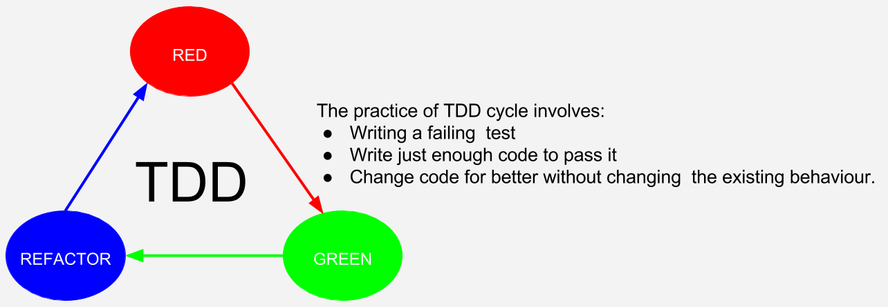
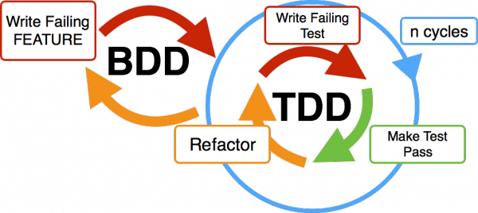

# 背景

最近手头项目不多，抽空将公司底层的一些代码重构了一下，试着想要加入单元测试(unit test)，之前总听大神说单元测试多么好，但是一直没空了解。当前总共有 2 中测试模式, TDD 和 BDD， 这里总结一下他们之间的优势和缺点。

## TDD

TDD(Test-driven development): 追求先写测试然后再写代码，所有代码为了通过测试而生。

### 优势

> 整个代码基于测试编写

- **非常高的测试通过覆盖率**: 整个代码基于测试编写(这能不高吗?(😂))
- **测试用例即开发文档**: 维护者或者代码 reviewer 甚至可以仅仅通过测试用例就能判定出是否符合功能需求
- **更易于重构**: 编写测试的优点是易于重构，TDD 将这优势放大，维护者必须先写测试用例，然后编写对应的代码，更有利于流程的控制(理清开发思路)
- **适用于底层工具开发**: 底层工具面向技术设计，和[TDD 设计原则](https://en.wikipedia.org/wiki/Test-driven_development)一致(`TDD encourages simple designs and inspires confidence`)。

### 缺点

> 过于死板，缺少灵活性，限制大，偏业务项目少用

- **时间翻倍效率减半**: 时间就是金钱, 在开发(尤其是业务逻辑)功能时，开发时间翻倍意味着绩效减半。
- **重构时间翻倍**: 敏捷开发需求迭代更新快，不适合灵活多变的代码
- **对新人不友好**: 需要熟悉先写测试，在写代码，测试成了需求文档(而不是真正的原型设计)
- **不适用于重度 css/html 项目**: 前端测试对 css/html 测试难度极大(一般都不写的)，更何况要先写测试用例。这会导致代码覆盖率降低

## BDD

BDD(Behaviour-Driven Development): 设定一个目标(可以是先编写测试，也可以先写代码)，只求内容与预期一致，不追求如何实现。

> 个人见解：BDD 开发面向业务。BDD 开发其实可以与 TDD 同时进行，是 TDD 的子集。**完美的 BDD= TDD**

### 优势

> 灵活性好，更好的开发体验

- **面向业务**: 前端项目绝大部分是基于业务的，更适合 BDD
- **开发效率高,渐进式开发**: 可以先编写代码，然后再写测试，在项目时间紧张的时候，可以简化(暂缓，不写)测试用例(事后补齐)
- **项目经理的文档**: 这些人员不关心实现细节，BDD 使用它们能够看懂的术语进行测试，能够提高对开发者的专业认可。

### 缺点

> 较低代码覆盖度，测试用例为附属品

- **代码覆盖度低**： 纯业务逻辑的话，覆盖率会不错。但是如果包含工具方法，覆盖率会直线走低。
- **结果导向，忽略代码质量**: BDD 面向结果，代码质量跟开发者水平息息相关，很难纠正不良的开发习惯

## 结论

个人认为: 相对于其他主流编程语言来说，单元测试重要性相对较低，这是跟语言特性相关的。javascript 语言本身重视灵活多变，动态，跨平台(依赖不同渲染引擎),写法千奇百怪(在 es6 之前)，这一切变得难以测试。
但是**测试依然是重要的，但是不是必须的**

- 单元测试能够理清**开发思路**，更好的**重构代码**
- BDD 测试更适合偏业务(轻底层)的风格
- 使用代码证明你的项目质量可靠(talk is cheap, show your code)

> 但是, 时间是有限的，所以个人建议只对核心的功能进行测试。

## Reference

- [Test-driven development](https://en.wikipedia.org/wiki/Test-driven_development)
- [Javascript Unit Testing for Beginners](https://designmodo.com/test-javascript-unit/#targetText=There's%20no%20need%20to%20unit,it's%20becoming%20much%20more%20powerful.&targetText=Not%20every%20JS%20project%20will%20need%20a%20unit%20test.)
